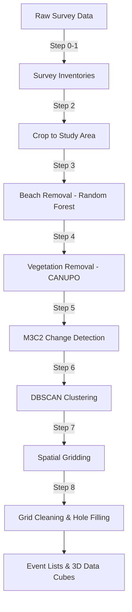

# Coastal Cliff LiDAR Change Detection Pipeline

A modular Python pipeline for processing terrestrial LiDAR surveys of coastal cliffs. Ingests raw point clouds, removes non-cliff features (beach, vegetation), performs 3D change detection (M3C2), clusters erosion and deposition events, and aggregates results into spatiotemporal grids for analysis.

> **Paper:** Mack, C.J., Maclay, M., Krier-Mariani, R., & Young, A.P. (2026). Integrated machine learning segmentation and 3D change detection for a scalable coastal cliff monitoring workflow. *Computers & Geosciences*, 106165. [doi:10.1016/j.cageo.2026.106165](https://doi.org/10.1016/j.cageo.2026.106165)

## Pipeline



## Requirements

- **Python** >= 3.9
- **PDAL** — point cloud cropping ([install](https://pdal.io/en/latest/download.html))
- **CloudCompare** — M3C2 and CANUPO ([install](https://www.danielgm.net/cc/))
- **xvfb** — required on headless Linux servers for CloudCompare steps

### Setup

```bash
# Conda (recommended)
conda env create -f environment.yml
conda activate cliff-change-detection

# Or pip
pip install -r requirements.txt
```

## Usage

Scripts in `code/pipeline/` run sequentially (0–8). Each step transforms data for the next.

| Step | Script | Description |
|------|--------|-------------|
| 0 | `0_make_survey_lists.py` | Build initial survey inventory CSVs |
| 1 | `1_update_survey_lists.py` | Update inventories with new surveys |
| 2 | `2_crop_files_parallel.py` | Crop raw LAS to study area via PDAL |
| 3 | `3_remove_beach_parallel.py` | Remove beach points (Random Forest) |
| 4 | `4_remove_veg_parallel.py` | Remove vegetation (CANUPO via CloudCompare) |
| 5 | `5_m3c2_parallel.py` | M3C2 change detection (CloudCompare) |
| 6 | `6_dbscan_parallel.py` | Cluster erosion/deposition events (DBSCAN) |
| 7 | `7_make_grids.py` | Aggregate into spatial grids (10cm, 25cm, 1m) |
| 8 | `8_clean_fill_grids.py` | Apply cliff-top cutoffs and fill occlusion holes |

Most scripts accept `--location <name>` or `--all`, and `--n_jobs` to control parallelism. Use `--help` on any script for full options.

```bash
# Example: process San Elijo through the full pipeline
python3 code/pipeline/2_crop_files_parallel.py --location SanElijo --replace
python3 code/pipeline/3_remove_beach_parallel.py SanElijo --n_jobs 5
python3 code/pipeline/4_remove_veg_parallel.py SanElijo --cc /path/to/CloudCompare
python3 code/pipeline/5_m3c2_parallel.py SanElijo --cc /path/to/CloudCompare
python3 code/pipeline/6_dbscan_parallel.py SanElijo --eps 0.35 --min_samples 30
python3 code/pipeline/7_make_grids.py SanElijo --resolution 25cm
python3 code/pipeline/8_clean_fill_grids.py SanElijo --resolution 25cm
```

### Automated Daily Pipeline

```bash
python3 code/pipeline/run_daily.py             # Process locations with new data
python3 code/pipeline/run_daily.py --force-all  # Force reprocess all
```

## Study Sites

| Location  | MOP Range |
|-----------|-----------|
| Blacks    | 520–567   |
| Torrey    | 567–581   |
| DelMar    | 595–620   |
| Solana    | 637–666   |
| SanElijo  | 683–708   |
| Encinitas | 708–764   |

## Testing

```bash
pytest tests/pytest/
```

## Citation

If you use this software, please cite:

```bibtex
@article{Mack2026,
  author  = {Mack, Connor J. and Maclay, Matthew and Krier-Mariani, Raphael and Young, Adam P.},
  title   = {Integrated machine learning segmentation and 3D change detection for a scalable coastal cliff monitoring workflow},
  journal = {Computers \& Geosciences},
  pages   = {106165},
  year    = {2026},
  doi     = {10.1016/j.cageo.2026.106165}
}
```

## License

See [LICENSE](LICENSE) for details.
